<div align="center">

<picture>
  <source media="(prefers-color-scheme: dark)" srcset="assets/header-dark.svg">
  <source media="(prefers-color-scheme: light)" srcset="assets/header-light.svg">
  
</picture>

<a href="https://github.com/WowSyler">
  
</a>

<p>
  <a href="https://www.linkedin.com/in/wowsyler/"></a>
  <a href="https://wowsyler.com"></a>
  <a href="https://medium.com/@WowSyler"></a>
  <a href="https://x.com/wowsyler"></a>
</p>

</div>

---

### `> whoami`

```csharp
public sealed record Developer : IPolyglot, IShipper
{
    public string Name     => "Ozan Küçük";
    public string Role     => "Senior Software Developer @ Boyner";
    public string Studio   => "WowSyler Software & Technology";
    public string Location => "Istanbul, Türkiye";

    public string   MotherTongue => "C# / .NET";
    public string[] Fluent       => ["TypeScript", "JavaScript", "Python", "Go"];
    public string[] Frontends    => ["Next.js", "React", "Angular", "Blazor"];
    public string[] Elsewhere    => ["Unity", "React Native", "Swift"];

    public IEnumerable<string> Believes()
    {
        yield return "Boring architecture, exciting products.";
        yield return "Measure first. Optimize second. Refactor always.";
        yield return "A system you can't observe is a system you don't own.";
    }
}
```

I've spent my career on the backend of things that can't go down: retail at scale, low-code
platforms, integration engines. .NET is home, but I go wherever the problem is, whether that's a Go
service, a Next.js frontend, a Python bot or a Unity scene. After hours I build my own products
under **WowSyler Software & Technology**.

---

### `> git log --career --oneline`

```diff
+ HEAD → Boyner ............................ Senior Software Developer
         Retail & e-commerce at scale, built on .NET
  ↑      PATH: Product & Software House
  ↑      Jitterbit ........................... integration & low-code (post-acquisition of PrimeApps)
  ↑      PrimeApps ........................... Software Engineer · low-code app platform (2020–2021)
  ↑      MutabikOl.com ....................... Software Developer (2019)
  ↑      Accor ............................... Software Developer (2018)
@ init   İstanbul Aydın University ........... Bachelor's degree (2015–2019)
```

---

### `> dotnet list package --stack`

<table>
  <tr>
    <td align="right" width="150"><b>Core</b></td>
    <td> </td>
  </tr>
  <tr>
    <td align="right"><b>Languages</b></td>
    <td></td>
  </tr>
  <tr>
    <td align="right"><b>Frontend</b></td>
    <td></td>
  </tr>
  <tr>
    <td align="right"><b>Mobile &amp; Games</b></td>
    <td></td>
  </tr>
  <tr>
    <td align="right"><b>Data &amp; Messaging</b></td>
    <td> </td>
  </tr>
  <tr>
    <td align="right"><b>Ops &amp; Observability</b></td>
    <td></td>
  </tr>
</table>

---

### `> ls ~/wowsyler/products`

| Product | What it is | Stack | Status |
|---|---|---|---|
| [**TextManipulator**](https://textmanipulator.com) | Text-processing workbench with chainable workflows | Go · TypeScript | 🟢 Live |
| [**AirdropBotPro**](https://airdropbotpro.com) | Multi-wallet, proxy-aware airdrop automation for EVM chains | .NET | 🟡 Building |
| [**Streea**](https://streea.com) | Discovery hub for movies, series, games, books & music | .NET | 🟡 Building |
| **Dolap** | Multilingual smart-wardrobe app for the whole family | TypeScript · Web / iOS / Android | 🟡 Building |
| **Appointment Platform** | Multi-tenant booking & digital menu for small businesses | .NET | 🟡 Building |
| **InspectRelease** | Code-aware visual regression review for deployments | TypeScript | 🟡 Building |

Open source to poke around in:
[`Checkout-Microservice-DDD`](https://github.com/WowSyler/Checkout-Microservice-DDD) (DDD + hand-rolled CQRS in C#) ·
[`general-design-systems`](https://github.com/WowSyler/general-design-systems) (TypeScript design-system toolkit)

---

### `> dotnet-counters monitor --process github`

<div align="center">
  
  
</div>

---

<div align="center">
  <sub><code>// TODO: build something people actually use. Repeat.</code></sub>
</div>
